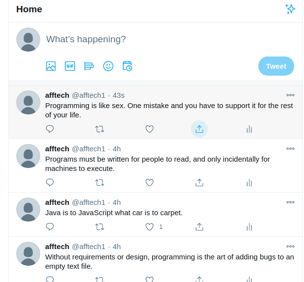

# Motivational Twitter-Bot


A twitter Bot that uses the twitter API to occasionally send Motivational quotes. You can use this to stay Motivated during high stress levels and low motivation levels.
It can be initialized on the command line(windows) / terminal(mac &amp; linux) where it tweets motivational messages(quotes).

## Built With

- Ruby 2.7.0
- VS Code
- Twitter Bot API
- Nokogiri gem
- Twitter-gem
- Open URI

-

## How to Install

`afftech` uses the `dotenv` gem in order to access Environment Variables for the required API key and Twitter access tokens.

Follow the next steps to configure all that's needed:

- Install Ruby in your system. To install Ruby, you can read the [Documentation](https://www.ruby-lang.org/en/documentation/installation/)
  If you have installed [Git](https://git-scm.com/book/en/v2/Getting-Started-Installing-Git) in your system, you can clone it using **git clone** command.
- Clone the project by running `https://github.com/ArreyTabe/Ruby-Capstone--Twitter-Motivational_Bot.git` on Terminal/CMD or download and extract it from the repository. OR
  Download it as a [Zip File](https://github.com/ArreyTabe/Ruby-Capstone--Twitter-Motivational_Bot.git`).
- Open Terminal/CMD and cd into the the folder you downloaded or cloned.
- Execute `touch .env` from the projects root directory
- make sure you have a [twitter devolper account](https://developer.twitter.com/en/apply-for-access), go to your dashboard and while still logged into your twitter account,the first thing you want to do is create a new app. For convenience, use the same name as your account.
- Adjust the permissions to `Read and write`
- Next, go to the API Keys page and click “Generate my Access Token,” and then copy:

- **Consumer Key**

- **Consumer Secret**

- **Access Token**

- **Access Token Secret**

- On your `.env` file add your token like this:

- config.consumer_key = "YOUR_CONSUMER_KEY"
- config.consumer_secret = "YOUR_CONSUMER_SECRET"
- config.access_token = "YOUR_ACCESS_TOKEN"
- config.access_token_secret = "YOUR_ACCESS_SECRET"

- Run `bundle install` from the project's root directory to install dependencies.
- Run `bundle exec bin/main.rb'
- Navigate to your twitter account

## How to Test the Methods In the Classes

Install Rspec gem in your system. To do this:

Open Command Prompt or Terminal and run:

```console
gem install Rspec
```

Navigate into the spec folder and run the following at the console:

```console
testing_tweetbot_spec.rb
```

## Deployment to Heroku

In order to deploy the bot to Heroku you need a free Heroku account and follow the next steps:

- Go to your [Heroku Dashboard](https://dashboard.heroku.com/apps) and click on the `New` button located on the top-right corner.

- Click on `Create new app` and then give it a name.
- Select a Deployment Method. GitHub is the easiest one since you only need to provide your credentials. To deploy from GitHub you need to have a copy of the source code hosted there, so do that before selecting GitHub as deployment method.

<b>Remember NOT to commit API credentials to public places.</b> The `.gitignore` file should handle that already but make sure you're not doing it.

- Set your API Credentials in Heroku as Environment Variables by clicking on the `Settings` tab and then adding them to the `Config Vars` section.
- Go to the `Resources` tab on Heroku and click on the pencil icon to edit the Heroku Dyno.
- Turn it on and click on Confirm. Once you do that everything should be ready.

_Twitter bot screenshot_

<p align="center"></p>

## Contributing

Contributions, issues, and feature requests are welcome! Start by:

- Forking the project
- Cloning the project to your local machine
- cd into the project directory
- Run git checkout -b your-branch-name
- Make your contributions
- Push your branch up to your forked repository
- Open a Pull Request with a detailed description of the development branch of the original project for a review
- [here is the issue link you can follow as well](https://github.com/ArreyTabe/Ruby-Capstone--Twitter-Motivational_Bot/issues)

## Author

👤 **Arrey Tabe**

- Github: [ArreyTabe](https://github.com/ArreyTabe)
- Twitter: [@tabe_arrey](https://twitter.com/tabe_arrey)
- LinkedIn: [Arrey Affuembey](https://www.linkedin.com/in/arrey-affuembey-80a8b11a8/)

## Acknowledgments

- [Twitter Ruby Gem Docs](https://www.rubydoc.info/gems/twitter) to get an understanding of what the twitter ruby gem is all about and how it works
- [How to Create a Telegram Bot Using Ruby by@peter-robert-ndungu](https://hackernoon.com/how-to-create-a-telegram-bot-using-ruby-n7ag32c1) gave me a first shot on how to go about my project
- [web scapping with Ruby](https://www.scrapingbee.com/blog/web-scraping-ruby/#make-a-request-with-http-clients-in-ruby) Helped me in scappinng my site
- [Ruby twitter bot tutorial](http://jenniferkruse.me/twitterbot.html) helped me and most especially in deploying to heroku
- [How to apply for a Twitter Developer account](https://www.extly.com/docs/autotweetng_joocial/tutorials/how-to-auto-post-from-joomla-to-twitter/apply-for-a-twitter-developer-account/#apply-for-a-developer-account) gave me an insight on how i could apply for and get my twitter developer account approved
- Microverse students
- [Learn to Use the Twitter API with Ruby](https://www.rubyguides.com/2016/04/twitter-api-from-ruby-tutorial/) from rubyguides

## Show your support

Give a ⭐️ if you like this project!

## 📝 License

This project is [MIT](https://choosealicense.com/licenses/mit/) licensed.
